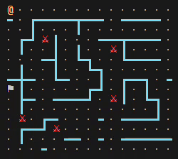

# Labirintite
Provavelmente o resolvedor de labirintos mais tonto que você já viu!

Projeto feito em equipe para disciplina de programação imperativa UFS 2024.2

## Guia de utilização
### Compilando da fonte

Para compilar, é recomendável que se utilize do seguinte comando

```bash
make all
```

No Windows, instale o [`tdm-gcc`](https://jmeubank.github.io/tdm-gcc/download) e execute o seguinte comando:

```bash
mingw32-make
```

### Executando

Após a geração de um arquivo executável, podemos iniciar o programa pela linha de comando:

```bash
./labirintite [LABIRINTO]
```

## Relatório

### Estrutura de dados

Para esse projeto, iniciamos definindo mais ou menos como seria a estrutura do labirinto. Após mexer muito no struct, ficamos com essa versão final:

```c
typedef struct {
  int posicao[2];
  int posicao_inicial[2];
  int inimigos_derrotados;
  int tentativas;
} Jogador;

typedef struct {
  char nome[50];
  FILE *arquivo;
  int modo;
  int tamanho[2];
  char **matriz;
  char **matriz_inicial;
  int menu;
  int posicao_saida[2];
  Trilha trilha;
  Jogador jogador;
} Labirinto;
```

*Imenso e confuso, né?* Veja bem, nossa struct vai armazenar tudo relacionado ao labirinto: nome, tamanho, matriz convertida, posições e até o arquivo do labirinto em si, por isso uma struct desnecessariamente grande parecia ideal (paradoxal?), mas eu juro que daqui pra frente é só alegria.

```c
typedef enum {
  PAREDE = '#',
  ESPACO = ' ',
  CAMINHO = '*',
  CAMINHO_LIVRE = '.',
  INIMIGO = '%',
  JOGADOR = '@',
  SAIDA = '$',
  TRILHA = '-'
} Celulas;
```

Definimos um enumerador contendo os caracteres possíveis para cada célula. Isso vai deixar o código mais maleável e legível, visto que poderemos mudar o caractere uma vez no enum com a garantia de que o programa continuará funcionando sem problemas

### Leitura do arquivo

Para esse projeto, iniciamos criando uma função para abrir o arquivo em modo leitura e o retornar como um ponteiro para acessos futuros.

```c
FILE *abrir_arquivo(const char *nome) {
  FILE *arquivo = fopen(nome, "r"); // Abre o arquivo em modo leitura

  if (arquivo == NULL)
    erro(L"Arquivo não encontrado"); // Erro caso arquivo não exista

  return arquivo;
}
```

Para fazer a leitura do arquivo retornado, fizemos uma função simples

```c
void ler_arquivo(Labirinto *labirinto) {
  int *tamanho = labirinto->tamanho;
  char primeira_linha[10]; // Vetor pra armazenar a primeira linha do arquivo

  if (fgets(primeira_linha, sizeof primeira_linha, labirinto->arquivo) == NULL)
    erro(L"Erro ao ler o tamanho do labirinto."); // Caso não esteja definido o tamanho do labirinto no arquivo

  if (sscanf(primeira_linha, "%d %d", &tamanho[0], &tamanho[1]) != 2)
    erro(L"Tamanho do labirinto inválido."); // Caso o tamanho não esteja definido no formato correto

  if (tamanho[0] < 2 || tamanho[1] < 2 || tamanho[0] > 20 || tamanho[1] > 20)
    erro(L"Tamanho do labirinto inválido. O labirinto deve ter entre 2 e 20 linhas e colunas."); // Caso o tamanho seja maior que 20x20

  // Vamos alocar as matrizes para que o preenchimento seja possível
  labirinto->matriz = alocar_matriz(tamanho[0], tamanho[1]);
  labirinto->matriz_inicial = alocar_matriz(tamanho[0], tamanho[1]);
  labirinto->matriz_com_trilha = alocar_matriz(tamanho[0], tamanho[1]);
}
```

Primeiramente, lemos a primeira linha do arquivo para puxar o tamanho do labirinto. Por exemplo:

```txt
2 2
. $
@ .
```

Nesse arquivo, a primeira linha `2 2` será lida e armazenada no vetor `primeira_linha`, que logo após é convertido para duas constantes independentes usando o formato `%d %d` para ser armazenado no struct `labirinto->tamanho`

### Salvar arquivo

Transformar nosso labirinto em um arquivo de texto é bem parecido com abrir um arquivo... Pedimos um nome para o arquivo e o colocamos num `fopen`. A única diferença, é que dessa vez abrimos em modo de escrita ao invés de leitura.

```c
void salvar_arquivo(const Labirinto *labirinto) {
  char nome_arquivo[100];

  printf("\nDigite o nome do arquivo: ");
  scanf("%99s", nome_arquivo);

  FILE *arquivo = fopen(nome_arquivo, "w");
  
  if (!arquivo)
    erro(L"Erro ao salvar o arquivo.");

  fprintf(arquivo, "%d %d\n", tamanho.x, tamanho.y);
}
```

Com `fprintf`, podemos escrever o tamanho do labirinto na primeira linha. Porém, ainda falta o labirinto em si.

Para isso, vamos fazer dois loops: um para linhas, e o outro para colunas:

```c
for (int i = 0; i < labirinto->tamanho[0]; i++)
  for (int j = 0; j < labirinto->tamanho[1]; j++) {
    fputc(labirinto->matriz[i][j], arquivo);
    fputc(j < tamanho.y - 1 ? ' ' : '\n', arquivo);
  }
```

Note que utilizamos do `fputc`. Isso porque ele digita apenas um caractere ao invés de uma sequência. Isso parecia ideal para esse caso.

### Menu interativo

Como todo jovem ansioso, odiamos coisas estáticas, por isso um menu interativo parecia essencial para nosso programa. Para isso, pesquisamos muito como seria uma implementação, e criamos o seguinte workflow:


Vamos explicar por partes.

#### Configurar ambiente

Para que o menu interativo funcione, teremos que, obviamente, ler quais teclas o usuário pressiona, certo? Bem, para isso tivemos que desativar o modo canônico do terminal para que as teclas pudessem ser lidas uma por uma sem precisar pressionar enter.

Essa implementação foi feita há 12 anos por um deus (pelo menos ao meus olhos, muito obrigado pela ajuda) chamado `dagon666`, disponível [aqui](https://gist.github.com/dagon666/8194870). Bem, apenas refatoramos a função pra ficar mais limpa e adequada as nossas necessidades.

```c
void configurar_terminal() {
  struct termios t;
  tcgetattr(STDIN_FILENO, &t);
  t.c_lflag &= ~(ICANON | ECHO);
  tcsetattr(STDIN_FILENO, TCSANOW, &t);
}
```

No Windows, a função é essencialmente a mesma, só mudando os nomes das funções e adequando ao sistema. Disponível em [SetConsoleMode function](https://learn.microsoft.com/en-us/windows/console/setconsolemode)

```c
void configurar_terminal() {
  entrada_terminal = GetStdHandle(STD_INPUT_HANDLE);
  GetConsoleMode(entrada_terminal, &config_terminal);
  SetConsoleMode(entrada_terminal,
                 config_terminal & ~(ENABLE_LINE_INPUT | ENABLE_ECHO_INPUT));
}
```

Certo, e agora? Como capturamos as teclas pressionadas?

Simples: no Linux, temos a função `read(STDIN_FILENO)` que vai ler a tecla pressionada e armazenar o valor no vetor `buffer`. Veja, pesquisando como é a captura de caracteres no terminal, descobrimos pela [Wikipédia](https://en.wikipedia.org/wiki/ANSI_escape_code#Terminal_input_sequences) que os terminais usam sequências para representar alguns caracteres, e como *confiamos 100% na Wikipédia*, pegamos as únicas duas sequências que precisamos de lá:

```txt
<esc>[A   - Up
<esc>[B   - Down
```

Ora, se a setinha pra cima é `<esc>[A`, e a setinha pra baixo é `<esc>[B` então só precisamos encontrar uma sequência de três caracteres que comece com `esc`e `[` e termine com `A` ou `B`; isso sabendo que `esc` equivale a `27` na tabela ASCII, `[` equivale a `91`, `A` = `65` e `B` = `66`. 

Confuso, mas com a seguinte tabela fica fácil de entender:

| Caractere | Código ASCII |
| - | - |
| ESC | 27 |
| [ | 91 |
| A | 65 |
| B | 66 |

Dito isso, podemos explicar o bloco

```c
int ler_tecla_pressionada() {
  char buffer[3];
  if (read(STDIN_FILENO, buffer, sizeof(buffer)) == sizeof(buffer) && buffer[0] == 27 && buffer[1] == 91) {
    if (buffer[2] == 65)
      return ACIMA;
    if (buffer[2] == 66)
      return ABAIXO;
  }
  return buffer[0];
}
```

Da seguinte forma:

1. Ler entrada e armazenar no `buffer`.
2. Caso seja de tamanho 3, continue.
3. Caso o primeiro caractere seja `ESC` (`27`), continue.
4. Caso o segundo caractere seja `[` (`91`), continue.
5. Caso o terceiro caractere seja `A` (`65`), sabemos que a tecla pressionada foi a setinha pra cima. Senão, continue.
6. Caso o terceiro caractere seja `B` (`66`), sabemos que a tecla pressionada foi a setinha pra baixo. Senão, continue.

Já no Windows, temos a função `_getch`, que nos permite ler o caractere exato que foi pressionado

```c
int ler_tecla_pressionada() {
  int caractere = _getch();
  return (caractere == 224)
             ? (_getch() == 72 ? ACIMA : ABAIXO)
             : (caractere == '\r' || caractere == '\n' ? '\n' : -1);
}
```

Se o caractere for `224` (prefixo da sequência das setinhas), então lemos de novo o próximo caractere. Se for `72`, então é setinha pra cima, senão, então é setinha pra baixo. Agora, se o caractere do inicio não tiver o prefixo de setinha, então retornamos que ele é ou `enter` ou inválido.

*Perfeito, agora precisamos fazer o menu, certo?*

### Menu interativo

Com o modo canônico desativado e a leitura de teclas funcionando, agora precisamos criar um loop onde as teclas são lidas e o menu impresso.

Vamos começar fazendo a função de impressão do menu:

```c
const char *lista_de_opcoes[] = {"Resolver diretamente", "Tentativa e erro",
                                 "Salvar em um arquivo", "Sair"};
int opcao_selecionada = 0;
```

Após definir no escopo `global` uma constante contendo todas as opções, podemos acessar ela de dentro da função `imprimir_opcoes`:

```c
void imprimir_opcoes(Labirinto *labirinto) {
  printf("Selecione uma opção:");

  for (int i = 0; i < 4; i++) {
    printf("%s %s\n", opcao_selecionada == i ? ">" : " ", lista_de_opcoes[i]);
  }
}
```

Já que agora podemos imprimir o menu, falta fazer ele ficar funcional. Para isso, vamos definir uma variável no escopo `global` que vai receber a opção atual selecionada:

```c
int opcao_selecionada = 0;
```

Ok, agora estamos prontos pra juntar tudo em um lugar só:


```c
while (1) {
  int tecla = ler_tecla_pressionada();
  
  imprimir_opcoes(labirinto);

  switch (tecla) {
    case ACIMA:
      opcao_selecionada = max(0, opcao_selecionada - 1); // O max garante que a opção não vá negativamente além de 0
      break;
    case ABAIXO:
      opcao_selecionada = min(3, opcao_selecionada + 1); // O min garante que a opção não vá além de 3
      break;
    case ENTER:
      switch (opcao_selecionada) {
      case 0:
        ...
        break;
      case 1:
        ...
        break;
      case 2:
        ...
        break;
      case 3:
        ...
        break;
      }
      break;
  }
}
```

*Tudo certo pra imprimir o labirinto, né?* **NÃO!!!**

Durante o desenvolvimento, vimos que a impressão de um labirinto de caracteres é muito difícil de entender (feia), por isso, decidimos mudar os caracteres padrões por equivalentes com um visual mais agradável. (Note que "mudar" é apenas na hora da impressão, ou seja, a matriz do labirinto nem o arquivo em si é alterado. É algo meramente visual).

Decidimos utilizar alguns caracteres unicode, porém, ao executar, notamos que eles simplesmente não funcionavam por padrão. Apesar da resolução no Linux ter sido bem rápida, no Windows demorou um pouco... para resolver, pesquisamos MUITO (papo de 3 dias)

Começando pelo Linux, foi bem simples, só precisamos colocar o terminal em `UTF-8`

```c
void configurar_idioma() {
  setlocale(LC_CTYPE, "en_US.UTF-8");
  setlocale(LC_ALL, "");
}
```

No Windows, porém, foi mais complicado. Nossa pesquisa nos levou a descobrir duas coisas:

1. O terminal do Windows usa a entrada `UTF-16` e a saída `UTF-8`
2. Por algum motivo `UTF-8` equivale a `65001`, não nos pergunte, só pegamos o identificador da tabela [Identificadores de página de código
](https://learn.microsoft.com/pt-br/windows/win32/intl/code-page-identifiers)

```c
void configurar_idioma() {
  _setmode(_fileno(stdout), _O_U16TEXT);
  SetConsoleCP(65001);
  SetConsoleOutputCP(65001);
}
```

### Imprimindo o labirinto

Agora sim, podemos imprimir o labirinto. Como nossa matriz é bidimensional, fizemos dois `for-loops`, um representando as linhas e outro as colunas.

```c
void imprimir_labirinto(Labirinto *labirinto)
{
    for (int i = 0; i < labirinto->tamanho[0]; ++i)
    {
        for (int j = 0; j < labirinto->tamanho[1]; ++j)
            printf("%c ", labirinto->matriz[i][j]);
        printf("\n");
    }
}
```

Isso funciona, mas mostra o simbolo como ele é: feio. E como não fizemos o trabalho de configurar o terminal pra aceitar caracteres Unicode atoa, vamos alterar o caractere antes de imprimir.

Isso é simples, só precisamos de uma função que, dado um caractere, retorne um Unicode equivalente.

```c
char mudar_caractere(Labirinto *labirinto, int linha, int coluna) {
  char caractere = labirinto->matriz[linha][coluna];

  for (int i = 0; mapa_caracteres_estaticos[i] != 0; i += 2) {
    if (mapa_caracteres_estaticos[i] == caractere)
      return mapa_caracteres_estaticos[i + 1];
  }

  return caractere;
}
```

Primeiramente, vamos falar sobre a mudança de caracteres estáticos (começando pelo mais simples). Para alterar um caractere estático, temos um `for-loop` mapeando um vetor, no estilo `key-value`, onde índices ímpares são `key` e pares `value`.

```c
char mapa_caracteres_estaticos[] = {
  INIMIGO,       '⚔',
  CAMINHO_LIVRE, '.',
  SAIDA,         '⚑',
  0, 0 // Para saber quando devemos parar o mapeamento, adicionamos valores nulos no final
};
```

Veja, como o `for-loop` avança de dois em dois a partir do índice zero, só precisamos comparar o caractere que queremos alterar com `mapa_caracteres_estaticos[i]` e puxar o valor de `mapa_caracteres_estaticos[i + 1]`

No entanto, essa solução não funciona para caracteres não estáticos, como paredes e trilhas, pois queremos que eles se conectem uns com os outros, dando continuidade. 

Porém, supondo que cada caractere possa se conectar para qualquer direção `n`, ficamos com uma quantidade `n^2` de possíveis caracteres. Em nosso caso, como as células adjacentes são apenas vizinhas diretas, excluindo diagonais, ficaríamos com um total de 16 valores e chaves. Como não queremos fazer um vetor com 32 elementos, sendo 16 deles redundantes ('#'), pensamos em uma outra forma:

Sabendo que existem `16` combinações possíveis para cada caractere, e que no inicio do desenvolvimento decidimos representar adjacências como um vetor `{ ACIMA, ABAIXO, ESQUERDA, DIREITA }` com valores possíveis: 0 ou 1, 

*por que não usar isso como um sistema binário?*

Ora, isso resolveria o problema, certo? Se fizéssemos isso com o seguinte vetor, por exemplo,

```c
int adjacencias = {0, 1, 0, 1}
```

teríamos `0101`, que representa o número `5`.

`{1, 1, 1, 1}` seria o número `15`. (Ou, com adjacencias em todos os lados)\
`{0, 0, 0, 1}` seria o número `1` (Ou, com adjacência somente na direita).

Notou algo? Cada possibilidade do vetor retorna um índice diferente, portanto, nosso mapa binário foi feito da seguinte forma:

```c
char mapa_binario[16] = {
    '━', 
    '━', // 0001, {0, 0, 0, 1} índice 1
    '━', // 0010, {0, 0, 1, 0} índice 2
    '━', 
    '┃', 
    '┏',
    '┓',
    '┳', // 0111, {0, 1, 1, 1} índice 7
    '┃', // 1000, {1, 0, 0, 0} índice 8
    '┗', // 1001, {1, 0, 0, 1} índice 9
    '┛', 
    '┻',
    '┃', 
    '┣',
    '┫', // 1110, {1, 1, 1, 0} índice 14
    '╋', // 1111, {1, 1, 1, 1} índice 15
};
```

Note que, como falamos anteriormente, um vetor `{1, 1, 1, 1}` com adjacências em todos os lados, retorna `━╋━`.

Isso nos leva a seguinte implementação:

```c
int index = 0;
int *adjacencias = encontrar_adjacencias(matriz, tamanho, linha, coluna);

for (int i = 0; i < 4; ++i)
  index |= adjacencias[i] << (3 - i);

return mapa_binario[index];
```

O que acontece aqui é simples: temos o index inicial, e um vetor de adjacências. A cada iteração, temos que `adjacencias[i] << (3 - i)`, onde o operador de bitshift `<<` desloca para a esquerda `3-i` vezes o valor `adjacencias[i]`. Após isso, o operador  bitwise `|=` soma ao index o resultado de `adjacencias[i] << (3 - i)`.

Exemplo:

```c
int *adjacencias = {0, 1, 0, 1};

for (int i = 0; i < 4; ++i)
  index |= adjacencias[i] << (3 - i);

/* Iterações
*               INDEX
*               -----
* Quando i = 0;   0   |=    0 << 3    =    0000 (0)
* Quando i = 1;   0   |=    1 << 2    =    0100 (4)
* Quando i = 2;   4   |=    0 << 1    =    0000 (0)
* Quando i = 3;   4   |=    1         =    0001 (1)
* Fim do loop;    5   
* 
* Isso resulta em index = 5 (0101), o valor que queremos.
*/
```

Agora sim, podemos imprimir o labirinto:


Eureka? É assim que se fala? Enfim, ainda tem um problema: como estamos renderizando espaços entre os caracteres, as paredes do labirinto ficam cheias de lacunas. Para resolver isso é simples: Se os caracteres da esquerda e da direita forem paredes, então entre eles, ao invés de espaço, adicionamos outra parede na horizontal.

```c
char preencher_lacuna(int linha, int coluna) {
  char caractere = matriz[linha][coluna];
  char proximo_caractere = matriz[linha][coluna + 1];

  if (parede(caractere) && parede(proximo_caractere)) {
    return '━';
  }

  return ESPACO;
}
```

Imprindo temos:


Legal, bonito, único. Mas... acho que falta umas corzinhas pra ficar bonito de verdade. Para isso só vamos usar o mesmo sistema de mapeamento que usamos para alterar caracteres estáticos:

```c
char mapa_cores[] = {
  PAREDE, AZUL,
  INIMIGO, VERMELHO,
  JOGADOR, AMARELO, 
  0, 0,
};

void colorir_caractere(char caractere) {
  for (int i = 0; mapa_cores[i] != 0; i += 2) {
    if (mapa_cores[i] == caractere)
      printf("%s", mapa_cores[i + 1]);
  }
}
```

Testando temos:


Ok, já chega de frufru, vamos fazer esse resolvedor funcionar.

### Movimento

*Pra resolver o labirinto, o jogador tem que se movimentar, né?*

Bem, pra isso só precisamos pegar a posição do jogador, e alterar ela para a direção desejada.

```c
void mover_jogador(Labirinto *labirinto, Direcoes direcao) {
  int *pos_adjacente = nova_posicao(pos_jogador.x, pos_jogador.y, direcao);
  char caractere_adjacente = labirinto->matriz[pos_adjacente.x][pos_adjacente.y];

  labirinto->matriz[pos_jogador[0]][pos_jogador[1]] = '*';

  pos_jogador.x = pos_adjacente.x;
  pos_jogador.y = pos_adjacente.y;

  labirinto->matriz[pos_adjacente.x][pos_adjacente.y] = JOGADOR;
}
```

Veja que ao alterar a posição do jogador, também alteramos o caractere para o qual o jogador vai se movimentar, e também o caractere anterior. No anterior, trocamos por `*`, e no novo, pelo jogador em si.

### Matando o jogador :(

Tudo que nasce, também morre. Pra que o jogador "morra", só precisamos restaurar sua posição original e restaurar, também, o labirinto.

```c
void matar_jogador(Labirinto *labirinto, char causa) {
  labirinto->matriz[pos_jogador.x][pos_jogador.y] = causa;
  labirinto->tentativas++;
  restaurar_labirinto(labirinto);
}
```

`Observação:` Tenha certeza do que está fazendo antes de matar o jogador. **Ele tem família.**

### Dias de luta

Caso o jogador dê o azar de passar por um inimigo, ele vai ter uma chance inicial de 50% de sair vivo. Essa chance, porém, aumenta 10% a cada inimigo que ele consegue derrotar.

```c
if (comparar_coordenadas(jogador, inimigo)) {
  if ((rand() % 100) > (50 + inimigos_derrotados * 10)) {
    mensagem("Jogador morto em combate :(");
    matar_jogador();
  } else {
    labirinto->inimigos_derrotados++;
  }
}
```

Utilizamos da função `rand()` que gera um número inteiro aleatório, entre `0` e a `casa do caralho` (Basicamente o limite de um número inteiro)

### Dias de glória

Nem só de batalhas desnecessárias vive o homem. O jogador também pode vencer. Para isso, basta que a posição dele seja a mesma da posição da saída. Para que isso seja possível, anexamos a posição da saída em um vetor de inteiros de tamanho 2, sendo a posição 0, a coordenada X e 1 a Y.

### Restaurando o labirinto
Ok, restaurar o labirinto é algo mais complexo, pois precisamos saber a forma original do labirinto. Tínhamos duas opções para restaurar o labirinto:

1. A partir do arquivo
2. A partir de uma matriz inicial pré-definida

Decidimos criar uma matriz bidimensional e armazenar o conteúdo do labirinto apenas para leitura, permitindo que o copiássemos para a matriz principal a qualquer momento.

```c
void restaurar_labirinto(Labirinto *labirinto) {
  pos_atual_jogador.x = pos_inicial_jogador.x;
  pos_atual_jogador.y = pos_inicial_jogador.y

  matriz_principal = matriz_inicial;

  inimigos_derrotados = 0;
}
```

Por partes, primeiro voltamos a posição atual do jogador para seus valores originais. Após isso, fazemos o mesmo com a matriz principal, e zeramos a quantidade de inimigos derrotados

### Resolução por tentativa e erro

Já dizia Raul Seixas: "E não diga que a vitória está perdida, se é de batalhas que se vive a vida. Tente outra vez".

Para resolver por tentativa e erro, só precisamos achar todas as direções possíveis, e randomizar algum caminho.

```c
void resolver_tentativa_e_erro(Labirinto *labirinto) {
  int resolvido = 0;
  int *direcoes = malloc(4 * sizeof(int));

  while (!resolvido) {
    int direcoes_possiveis = 0;

    char *adjacencias = encontrar_adjacencias(posicao.x, posicao.y);

    for (int i = 0; i < 4; ++i)
      if (adjacencias[i] == CAMINHO_LIVRE)
        direcoes[direcoes_possiveis++] = i;

    if (!direcoes_possiveis) {
      mensagem(labirinto, "Sem movimentos válidos! Reiniciando...");
      matar_jogador();
      continue;
    }

    int escolha = direcoes[rand() % direcoes_possiveis];
    mover_jogador(escolha);
    
    atualizar_interface(labirinto);

    if (comparar_coordenadas(pos_jogador, posicao_saida))
      resolvido = 1;
  }
}
```

Para encontrar as direções válidas, procuramos por adjacências e checamos quais delas são `CAMINHO_LIVRE`. Dessa forma, podemos mapear os possíveis passos do jogador em determinada posição. Caso não tenha nenhuma direção válida, o jogador é morto e o labirinto reinicia.

### Resolução direta

Pra fazer a resolução direta, não conseguimos pensar em nada além da boa e velha busca em profundidade, mesmo que **uma versão bem, mas bem capenga desse algorítimo**. 

Para que isso funcione, fizemos uma outra matriz que vai armazenar os **nós** que foram visitados.

***Nós?*** *Nós quem?*

**Nó**, é a mesma coisa de vértice. E se você não sabe o que é vértice, é tipo uma célula, e se você não sabe o que é célula, é tipo uma casinha pro caractere... Enfim, eu poderia continuar a lançar definições infinitamente (Ou iterativamente, sei lá), mas vamos poupar esforços para o que importa: terminar o relatório.

Olha, busca em profundidade é simplesmente uma forma de visitar cada ramificação até chegar na saída desejada. Para isso, os vértices são visitados um por um, e quando não houver mais saída, retrocedemos as casas uma por uma até encontrar um ramo ainda não explorado.

Note que, ao retroceder o jogador, quebraríamos uma das regras do labirinto. Por isso, a busca em profundidade será realizada pelo que chamamos de `trilha`

Nossa *trilha* é simples, ela explora sempre o primeiro caminho disponível, e se for errado ela volta.

Certo, então dá pra começar a fazer as funções de movimento da nossa trilha.

```c
void mover_trilha(int direcao) {
  int *proxima_pos = nova_posicao(pos_trilha.x, pos_trilha.y, direcao);

  char caractere_adjacente = matriz[proxima_pos.x][proxima_pos.y];

  if (caractere_adjacente != SAIDA && caractere_adjacente != INIMIGO) {
    matriz[proxima_pos[0]][proxima_pos[1]] = '-';
  }

  pos_trilha.x = proxima_pos.x;
  pos_trilha.y = proxima_pos.y;

  trilha[tamanho_trilha++] = direcao;
}
```

Note que a função é bem parecida com a função de mover o jogador... a ideia é essencialmente a mesma:

1. Calcula a próxima posição
2. Pega o caractere dessa posição
3. Se o caractere for um caminho livre, transforma em um hífen (para simbolizar a trilha)

Perfeito, se o jogador não pode se movimentar pelos asteriscos, a trilha também não tem motivos para se movimentar pelos hífens. (A menos que ela queira entrar em um possível loop e andar infinitamente)

*Certo, a trilha anda, mas e se ela chegar num beco sem saída?*

Para tudo tem solução. Nesse caso, a cada passo da trilha, ela tem o histórico armazenado num vetor unidimensional, que vamos chamar de `stack`. Quando quisermos retroceder, bastar buscar no stack de tamanho `n`, o valor de `n-1`.

Certo, mas o que exatamente é armazenado no `stack`?

Bem, lembra que no inicio do tópico eu disse que nossa versão de busca em profundidade é bem capenga? Eu não estava brincando. Poderíamos ser convencionais e armazenar o estado do vértice, mas decidimos que faria mais sentido para nós, armazenar apenas o movimento que foi feito.

Então, quando a trilha se movimenta pra cima, armazenamos o número `0` no stack; para baixo, o número `1`, e assim por diante. Quando a trilha quiser retroceder, ela só pega a direção contrária daquela armazenada no stack.

```c
void retroceder_trilha() {
  int direcao_anterior = trilha.stack[--trilha.tamanho];

  int *pos_anterior = nova_posicao(trilha.posicao.x, trilha.posicao.y, direcao_anterior);

  char caractere = matriz_inicial[trilha.posicao.x][trilha.posicao.y];

  matriz[trilha.posicao.x][trilha.posicao.y] = '*';

  trilha.posicao.x = pos_anterior.x;
  trilha.posicao.y = pos_anterior.y;
}
```

Agora a trilha *pode* andar livremente, tal qual um carro ligado sem rodas. Isso por que ainda falta juntar tudo e definir as condições para que ela se movimente:

```c
int direcoes_possiveis = encontrar_direcoes(trilha);

if (!direcoes_possiveis) {
  if (labirinto->trilha.tamanho) {
    retroceder_trilha();
    continue;
  }
  mensagem("Sem movimentos válidos!");
  break;
}

mover_trilha(direcao);
```

Veja que primeiro procuramos direções possíveis baseadas na posição atual da trilha. Caso não existam direções possíveis, ela retrocede.

Note que ao retroceder, a trilha volta uma casinha, e o loop reinicia. Nesse momento, teremos a checagem novamente: se não existirem posições possíveis além da casinha que ele já visitou, então ele retrocede novamente.

*Mas o que acontece quando a trilha encontra a saída?*

Aí é só alegria. Nesse momento, comparamos as coordenadas da trilha e da saída. Caso sejam iguais, Podemos começar a mover o jogador.

```c
if (comparar_coordenadas(trilha, saida)) {
  mensagem("Saída encontrada! Movendo o jogador...");
  matriz = trilha.matriz;
}
```

Note que estamos copiando a matriz da trilha para a nossa matriz principal, isso porque queremos manter os hífens que deixamos pelo caminho, assim o jogador saberá por onde deve seguir.



### Resolução bônus

Enquanto pesquisavamos sobre os algorítimos de resolução, nos deparamos com o artigo [A * Pathfinding para Iniciantes de Patrick Lester](https://www.inf.ufsc.br/~alexandre.goncalves.silva/courses/14s2/ine5633/trabalhos/t1/A%20%20%20Pathfinding%20para%20Iniciantes.pdf). Ficamos bastante interessados nesse algoritmo pois, diferente da busca em profundidade, ele tenta encontrar o caminho menos custoso.

    Surpreendentemente ou não, a implementação do A* nos demandou menos esforço do que a busca em profundidade.

Começamos definindo uma função para calcular a distância de Manhattan...

*A distância de Manhattan é 6.880 km*

Ok, fico feliz em saber a distância de Aracaju até Manhattan, mas não é dessa distância a qual me refiro. Na verdade, estamos falando de uma fórmula para calcular a distância entre dois pontos.

*Ah entendi, e isso vai servir pra calcular a menor distância entre esses dois pontos?*

Não, ele não calcula a menor distância entre dois pontos... para isso teriamos que usar a fórmula de distância euclidiana, que garantiria que encontrassemos a menor distância entre o jogador e a saída. Porém, tem um problema: a distância euclidiana mede uma linha reta, e é sabido que não podemos movimentar o jogador na diagonal, nem atravez de paredes. Dessa forma, não temos motivos para querer a menor distância possível.

A distância de Manhattan, na verdade, calcula a distância entre dois pontos quando é possível se mover apenas na horizontal ou na vertical. Isso é perfeito para nosso caso.


Implementando a função, temos:

```c
int dist_manhattan(int ponto_atual[2], int destino[2]) {
  return abs(ponto_atual.x - destino.x) + abs(ponto_atual.y - destino.y);
}
```

*Certo, mas como e onde usaremos essa função?*

Antes de explicar isso, deixa eu te mostrar o struct de um vértice:

```c
typedef struct {
  int posicao[2];
  int origem[2];
  int peso;
  int custo;
} Vertice;
```

Veja que definimos um inteiro `custo`. Isso é uma predição do quão custoso é se mover de um determinado vértice até a posição final.

Entende onde quero chegar? A função da distância de Manhattan vai ser usada para calcular esse custo.

Então podemos começar a implementar:

```c
Vertice *stack = calloc(linhas * colunas, sizeof(Vertice));

Vertice vertice_inicial = { 
  .posicao = { jogador.x, jogador.y },
  .origem  = { -1, -1 },
  .custo   = dist_manhattan(jogador, saida) 
};

stack[trilha.tamanho++] = vertice_inicial;
```

Primeiro, criaremos um `stack` de vértices, que vai funcionar de forma semelhante ao stack que implementamos na busca em profundidade. Vamos definir um vértice inicial manualmente, com posição na origem do labirinto.

A partir disso, se inicia nosso loop. Como temos apenas o vértice inicial por enquanto, vamos acessar ele e procurar por adjacências:

```c
while (trilha.tamanho > 0) {
  Vertice vertice_topo = stack[0];

  for (int i = 0; i < 4; ++i) {
    int *pos_adjacente = nova_posicao(vertice_topo.x, vertice_topo.y, i);

    char caractere = matriz[pos_adjacente.x][pos_adjacente.y];

    if (parede(caractere) || visitado)
      continue;

    int peso = vertice_topo.peso + 1 + (inimigo(caractere) ? 10 : 0);

    Vertice adjacente = { .peso    =  peso,
                          .custo   =  peso + dist_manhattan(pos_adjacente,  saida),
                          .posicao = { pos_adjacente.x, pos_adjacente.y },
                          .origem  = { vertice_topo.posicao.x, vertice_topo.posicao.y }
                        };

    stack[trilha.tamanho++] = adjacente;
  }
}
```

Note que ignoramos paredes e caminhos já visitados. O método é o mesmo já foi bem definido nesse relatório:

1. Procurar posições adjacentes
2. Caso seja parede ignore
3. Caso válido, adicione ao stack

Nisso, a trilha vai procurar apenas caminhos válidos. E caso se depare com um inimigo, o peso do vértice é aumentado.

Tudo certo, mas falta definir quais os vértices menos custosos. Isso é simples, basta comparar o custo de cada vértice com o custo do vértice atual:

```c
int menor_custo = 0;

for (int i = 1; i < labirinto->trilha.tamanho; ++i) {
  if (stack[i].custo < stack[menor_custo].custo) {
    menor_custo = i;
  }
}

Vertice vertice_topo = stack[menor_custo];
stack[menor_custo]   = stack[--labirinto->trilha.tamanho];
```

Se você tiver entendido corretamente esse bloco de código, você deve estar se perguntando por que diabos removemos o vértice de menor custo do stack. Bem, a primeira vista realmente é confuso, mas não estamos *descartando* ele.

Quando removemos um vértice do stack, significa dizer que estamos prontos para buscar adjacências. Então é basicamente o contrário de descartar, na verdade estamos aumentando as apostas de que aquele vértice é um caminho promissor para encontrar a saída.

Isso também nos garante que vários caminhos podem ser explorados ao mesmo tempo, dependendo do custo de cada vértice. Por exemplo, se eu tiver um vértice promissor a esquerda, e na iteração seguinte, um a direita, a trilha se ramifica como os galhos de uma árvore.


## Créditos

 * Iarlo Bruno Damasceno De Sá - <iarlo.sa@dcomp.ufs.br>
 * Karlus Dória Da Silva Júnior - <karlus@academico.ufs.br>
 * Jaqueline Nascimento - <jaquelinenascimento@academico.ufs.br>

### Licença
Licenciado com GNU General Public License

This program is free software: you can redistribute it and/or modify it under the terms of the GNU General Public License as published by the Free Software Foundation, either version 3 of the License, or (at your option) any later version.

This program is distributed in the hope that it will be useful, but WITHOUT ANY WARRANTY; without even the implied warranty of MERCHANTABILITY or FITNESS FOR A PARTICULAR PURPOSE.  See the GNU General Public License for more details.

You should have received a copy of the GNU General Public License along with this program.  If not, see <https://www.gnu.org/licenses/>.

